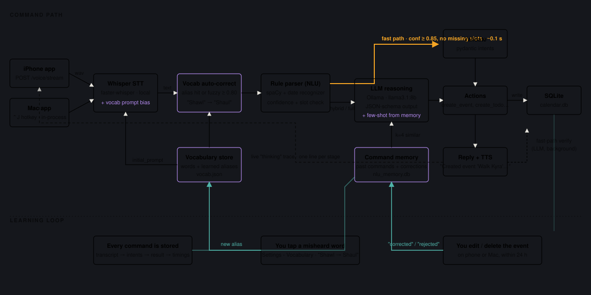

# Calendar Assistant (Mac)

A privacy-focused, voice-driven calendar assistant for macOS. This tool uses local AI models (Ollama for reasoning and Whisper for speech-to-text) to manage your calendar events without sending audio to the cloud.

> [!IMPORTANT]
> This application is specifically designed for **macOS** and leverages native features like the `say` command, system accessibility hooks, and macOS native dialogs.


## How the AI assistant works



A spoken command goes: **Whisper (MLX, on the Apple GPU)** → **personal vocabulary auto-correct** → **rule parser** (spaCy + date recognizer; answers ~44% of commands in ~100 ms with no LLM) → **local LLM** (Ollama, llama3.1:8b) when the rule parser is unsure, with your most similar past commands injected as examples → validation → actions → SQLite. Every command is remembered; your edits, deletes and approve/reject become feedback that improves the next parse. Details: [DOCUMENTATION/SYSTEM.md](DOCUMENTATION/SYSTEM.md), audit: [DOCUMENTATION/ASSISTANT_AUDIT_SUMMARY.md](DOCUMENTATION/ASSISTANT_AUDIT_SUMMARY.md).

**The LLM sees every command, whichever path answered it.** A rule-path answer
is returned immediately and then reviewed in the background: the model re-reads
the transcript against what actually ran and says whether it agrees. It reports
rather than rewrites — measured over the corpus, applying its corrections fixed
nothing and broke one thing, so it advises and the trace shows what it thought.
What *does* correct itself is narrower and evidence-based: an action that
matches nothing re-parses with the LLM instead of answering "I couldn't find
that", and an event the rules could only call "meeting" is named properly
before you are told about it.

### One brain, two surfaces

`assistant.api` parses and executes **everything**. The Mac GUI and the iPhone
are both clients of it — the GUI posts to `127.0.0.1:8080`, the phone posts over
Tailscale, and `source` (`"mac"` / `"ios"`) is the only difference between them.
They previously had separate implementations of the same pipeline, which drifted
until the same sentence produced different results depending on which microphone
heard it.

### Nothing leaves the machine

Whisper runs on the GPU from a cached model, the LLM is Ollama on `localhost`,
spaCy and the date recogniser are local, the Hebrew calendar is pure Python, and
the database is a file in `~/.assistant_tools/`. There is no account, no API key
and no telemetry. `tests/unit/test_offline.py` blocks every non-loopback socket
and fails the build if that ever stops being true.

### Seeing what it did — the thinking HUD

Every stage of that pipeline streams live to a small always-on-top card: what
it heard, which parse path answered, what it changed, and how long each step
took. Tap a misheard word to teach it; 👍/👎 feeds the command memory.

It is **its own application**, not part of the calendar window, because a
command given from your phone arrives while you are working in something else —
and the calendar app may not even be open. So it floats over whatever you are
actually in, never takes keyboard focus, and sits slightly translucent until
you hover it. Drag it by its header to move it; right-click for Hide / Reset
position / Quit.

It appears on the first command and then **updates in place** rather than
re-announcing itself, and closing it is an instruction it remembers — reopen
from the menu bar item. Commands that arrive while it is closed are still
recorded.

**History** lists every command it has ever run, newest first: when, from which
device, what you said and what it did. Click one to replay its full timeline.
Search matches both what you said and what it answered, and chips narrow by
device (Mac / iPhone), by kind (Events / Tasks), and to the ones that went wrong
(Failed). Scripted runs are tagged and hidden unless you ask for them.

`Launch Calendar.command` starts it. On its own: `python -m assistant.thinking_hud`.
Turn it off in **Settings › Assistant** (`ui.show_thinking`), or move it with
`ui.thinking_corner`.

## Prerequisites

Before installation, ensure you have the following:

- **Hardware:** A Mac (Apple Silicon M-series recommended for best performance).
- **Python:** Version 3.11 or higher.
- **Microphone Access:** You will need to grant your Terminal or IDE permissions to access the microphone.
- **Ollama:** Download and install [Ollama](https://ollama.ai).
  - After installing Ollama, pull the reasoning model: `ollama pull llama3.1:8b` (or your preferred model according to `config.yaml`).

## Installation

1. **Clone the project:**
   ```bash
   git clone <repository-url>
   cd assistant_tools
   ```

2. **Set up a Virtual Environment:**
   ```bash
   python3.11 -m venv .venv
   source .venv/bin/activate
   ```

3. **Install Dependencies:**
   ```bash
   pip install --upgrade pip
   pip install -e .
   ```

## Configuration

The application uses `config.yaml` for customization. If it doesn't exist, you can create it from the example:
```bash
cp config.example.yaml config.yaml
```

### Key Settings:
- **`llm_engine`**: Choose your reasoning brain:
  - `"ollama"` (Default): Free, local, private. Requires Ollama to be running.
  - `"openai"`: High performance. Requires `openai.api_key`.
  - `"gemini"`: Google's LLM. Requires `gemini.api_key`.
  - `"claude"`: Anthropic's LLM. Requires `claude.api_key`.
- **`hotkey`**: The trigger for the voice listener (default is `Cmd+Shift+Space`).
- **`tts`**: 
  - `voice`: Preferred system voice (e.g., `"Ava"`, `"Zari"`, `"Samantha"`). Run `say -v \?` in your terminal to see all options.
  - `rate`: Talking speed.
  - `mute`: Set to `true` for a silent assistant.
- **`ui.show_thinking`** / **`ui.thinking_corner`**: whether the thinking HUD appears,
  and which screen corner it parks in until you drag it somewhere else.
- **`todo.auto_tag`** / **`todo.auto_tag_infer`**: `auto_tag` is "tag mode" — every new
  task gets that one tag. With it empty, a tag is inferred from the title instead
  ("buy chicken" → Groceries), and only tags that already exist are ever used.
- **`api.port`**: where the API listens (default `8080`). Both the phone **and the
  Mac GUI** post commands there, and the HUD uses it too.
- **`verify_fast_path`** / **`self_check_apply`**: the background LLM review. The
  first is on — every command is re-read by the model and its verdict shown in the
  trace. The second is off, and the comment beside it in `config.yaml` carries the
  measurement: applying those corrections fixed 0 commands and broke 1.
- **`confirmation_level`**: **no longer has any effect.** The dialog belonged
  between parse and execute, and both now happen in the API process, which has no
  screen. The GUI warns at startup if you have it set above 0.

## Usage

### Starting the App
- **The easy way:** Double-click `Launch Calendar.command` in the Finder. It starts
  everything: Ollama (if it isn't already up), the API server, the thinking HUD,
  and the calendar window. Closing the calendar window stops the rest.
- **The terminal way:** the API first, because the calendar window is a client of
  it and will say so if it is missing —
  ```bash
  python -m assistant.api --tailscale --reload  # THE BRAIN — start this first
  python -m assistant.main                      # the calendar window
  python -m assistant.thinking_hud              # the always-on-top trace card
  ```
  `--reload` restarts the API when anything under `assistant/` changes, so editing
  the assistant does not mean relaunching everything. **The GUI and the HUD do not
  reload** — restart those by hand.

  They share no memory: the calendar DB is the source of truth, and traces travel
  between them through `~/.assistant_tools/trace_bus.jsonl`.

### Views
- **Month / Week / Day** — Switch between views using the toolbar buttons.
- The **Day view** shows a full hourly timeline for any single date with a live red current-time indicator.
- **Tasks** — Apple Reminders-style task panel with Today and General lists (see below).

### Morning Briefing
Click the **Brief Me** button in the Day view (or ask via voice) to have your assistant read today's full schedule aloud — great for hands-free mornings.

Voice triggers: *"What does my day look like?"*, *"When is my first meeting?"*, *"What's next?"*, *"How many events do I have today?"*

### Tasks View
Switch to **Tasks** in the toolbar to manage your todo list with two sections:

| Section | Purpose |
|---------|---------|
| **Today** | Tasks for today. Click **Sync Today** to pull in today's calendar events automatically. |
| **General** | Ongoing or someday tasks, independent of any date. |

**Manual editing:** Click any task title to edit it inline. Click the checkbox to complete it. Hover to reveal the × delete button. Click **+ New Task** to add from the keyboard.

**Calendar sync:** The **Sync Today** button in the Today header pulls all of today's calendar events into your Today list as tasks. The gear icon offers additional sync options (upcoming week → General list, or clear synced tasks).

**Tags:** every task can carry tags (Coursework, Groceries, Errands, Work, Personal,
plus any you add). Filter by them with the chips above the list. A task created
without one gets a tag inferred from its title — *"buy chicken"* → Groceries — and
nothing at all when it isn't sure, since a wrong tag has to be undone by hand.
Turn that off with `todo.auto_tag_infer`, or force one tag onto everything new with
"tag mode" (`todo.auto_tag`).

**Voice commands (Tasks mode):**
When the Tasks tab is active, the mic button enters *Tasks mode* — voice commands are automatically biased towards task actions:
- *"Add task buy groceries"* — adds a single task
- *"Add tasks: buy milk, call dentist, walk the dog"* — adds multiple tasks at once
- *"Buy chicken and rice"* — **one task per item**, sharing the verb: *buy chicken* and
  *buy rice*, both tagged Groceries. Same for *"call mom and dad"*. An "and" that
  belongs to one errand is left alone, so *"buy a gift for mom and dad"* stays a
  single task, and so does *"fish and chips"*.
- *"Mark buy milk done"* / *"Check off call dentist"* — complete a task
- *"Delete buy groceries"* / *"Remove it"* — delete by title or by anaphoric "it"
- *"Rename buy milk to buy oat milk"* — update a task
- *"Move call dentist to general list"* — change list
- *"Put milk and bananas on the groceries list"* — tag as you add
- *"What tasks do I have today?"* — read out the list (switches to Tasks view)

> [!TIP]
> **Context Memory:** Within the Tasks view, "it" and "that task" always refer to the last task you created or modified.

### Interacting with Voice
1. **Trigger:** Press the hotkey (`Cmd+Shift+Space`) to start listening.
2. **Speak:** State your request clearly (e.g., *"Schedule a dentist appointment for tomorrow at 2 PM"* or *"Cancel my meeting with Alex"*).
3. **Finish:** Say **"execute"**, **"done"**, or simply press the hotkey again to trigger the actions immediately.
4. **Autonomous Mode:** You can toggle "Auto-Approve" in the **Settings** icon in the UI to skip confirmation dialogs.

> [!TIP]
> **Context Memory:** You can refer to the last event you created by saying "delete **it**" or "move **that event**". Same works for tasks.

## Security & Privacy
- **LLM Choices:** By default, everything is local and private using Ollama. If you switch to `openai`, `gemini`, or `claude`, your transcripts will be sent to the respective provider's API.
- **Full Local Logic:** Audio is transcribed locally using `faster-whisper`.
- **Prompt Injection Defense:** Basic sanitization prevents malicious commands from being executed via voice.
- **Persistence:** closing the application will save all your changes to the `.db` file normally.

## Testing
A comprehensive test suite is provided to verify model reasoning and database logic:
```bash
# Calendar voice command tests (requires Ollama running)
python tests/test_ollama_parser.py

# Todo feature tests — direct execution (no LLM required)
python tests/test_todo_parser.py --direct

# Todo feature tests — full LLM routing (requires Ollama running)
python tests/test_todo_parser.py

# Full unit test suite
pytest tests/
```

Don't judge a change to the assistant by trying a couple of phrasings — run the
audit harness, which puts a corpus of ~90 real commands through the whole path
and reports accuracy by area and by parse path:

```bash
python -m scripts.audit_assistant              # full, ~10 min
python -m scripts.audit_assistant --area tasks # one area
```

It writes [DOCUMENTATION/ASSISTANT_AUDIT.md](DOCUMENTATION/ASSISTANT_AUDIT.md); the
standing conclusions live in [ASSISTANT_AUDIT_SUMMARY.md](DOCUMENTATION/ASSISTANT_AUDIT_SUMMARY.md).

## iPhone App

MACalendar includes a native SwiftUI companion app and a Flask REST API. The Mac acts as the source of truth, and the iPhone connects via Tailscale to manage events and tasks from anywhere.

### 1. Deploy the App (via Xcode)
1. Open `MACalendar-iOS/MACalendar-iOS.xcodeproj` in **Xcode**.
2. Set your **Signing Team** in *Signing & Capabilities*.
3. Connect your iPhone and click **Run**.
4. (First time) Go to iPhone **Settings → General → VPN & Device Management** and **Trust** your developer profile.

### 2. Connect via Tailscale (Recommended)
Tailscale provides a secure, private tunnel between your Mac and iPhone without port forwarding.
1. **Mac:** `brew install tailscale` → Sign in.
2. **iPhone:** Install [Tailscale](https://apps.apple.com/app/tailscale/id1470499037) → Sign in.
3. **Start API:** `python -m assistant.api --tailscale` (Prints your 100.x.x.x IP).
4. **App Settings:** Set Server URL to `http://<your-tailscale-ip>:8080`.

For full deployment details and API reference, see [**SYSTEM_IPHONE.md**](DOCUMENTATION/SYSTEM_IPHONE.md).

### API endpoints (quick reference)

| Method | Path | Purpose |
|--------|------|---------|
| GET | `/health` | Server status |
| GET | `/events?date=YYYY-MM-DD` | Events for a day |
| POST | `/events` | Create event |
| POST | `/voice/text` | Voice command as text |
| GET | `/todos` | Todo list |
| PATCH | `/todos/<id>/toggle` | Complete a task |

Full API reference: [DOCUMENTATION/API_REFERENCE.md](DOCUMENTATION/API_REFERENCE.md) (generated from the server code)

---

## For Developers & AI Assistants

Start with **[CLAUDE.md](CLAUDE.md)** for the workflow — how to keep tests out of
your real vocabulary and command memory, how to measure a change to the
assistant, and the things that have bitten before. Then **[SYSTEM.md](DOCUMENTATION/SYSTEM.md)**. It contains the full project architecture, recent core enhancements (Streaming STT, Universal LLM Parser), and current state details to help you resume work without loss of context.
